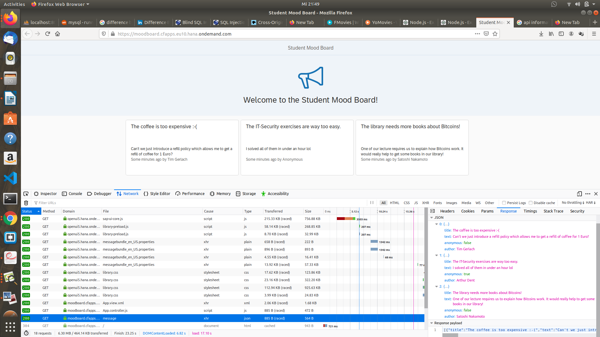

# Exercise 3: API Information Disclosure.

## 1. Find out the name of the student who posted the message and explain the steps you performed to reveal it?

### Step -1 Go to the Website “https://moodboard.cfapps.eu10.hana.ondemand.com/” you will get to this page:

### Step -2 Now go to the inspect element tab -

### Step-3 Now go to the Networks tab in the inspect elements. There we find a file name message with Json type.

### Step-4 Go to that file and a new side window will open -

### Step – 5 Go to the Response tab on that side window -

### Step – 6 Here you can find all the Author names who leave the comment on the website -

As you can see it is Arthur Dent who leave a message as anonymous user.

## 2. What is your advice to the developer of the SRH Student Mood Board to close the information disclosure.

There are several ways by which SRH Student Mood Board can close the information disclosure:

    • By making sure that the server does not send out the response headers or background information that reveals the technical details anout the backend.
    • The services which are running on the open ports does not reveal the information about their build and versions.
    • Make sure that the credentials, API keys, IP addresses, first name, last name or any other important information is not available in the code not even in the form of comments.
    • Correct type of MIME configuration on the web server for the files which are avaiable on the web server.
    • Do not upload important or sensitive files on the web server.
    • Checking each request for create/edit/view/delete resources has proper access control or not which will prevent the escalation issues and make sure that all the confidential information will remain confidential.
    • Check if the web application process the user input correctly or not and does it make the generic response is always returned for all the resources that don’t exist.
    • By implementing enough validation to prevent the valuable information leakage.
    • Configure the web server to turn down any exceptions which may arise.
    • Set the configuration of the web server in such a manner by which it disallow directory listing.

## Reference

- https://www.netsparker.com/blog/web-security/information-disclosure-issues-attacks/
