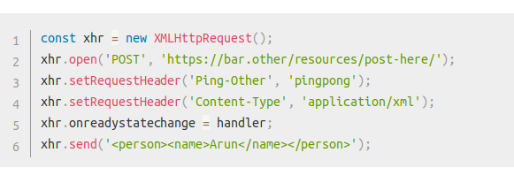
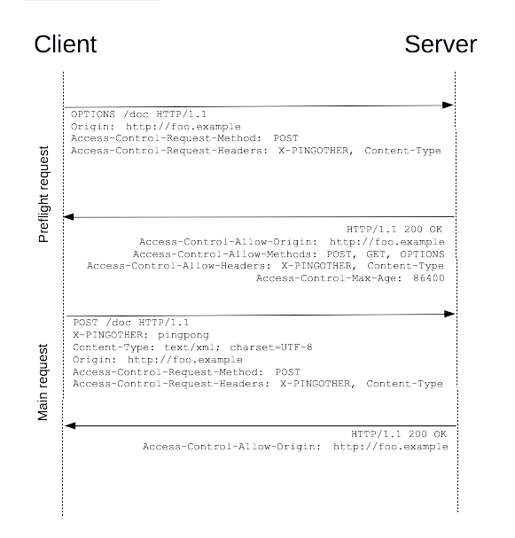
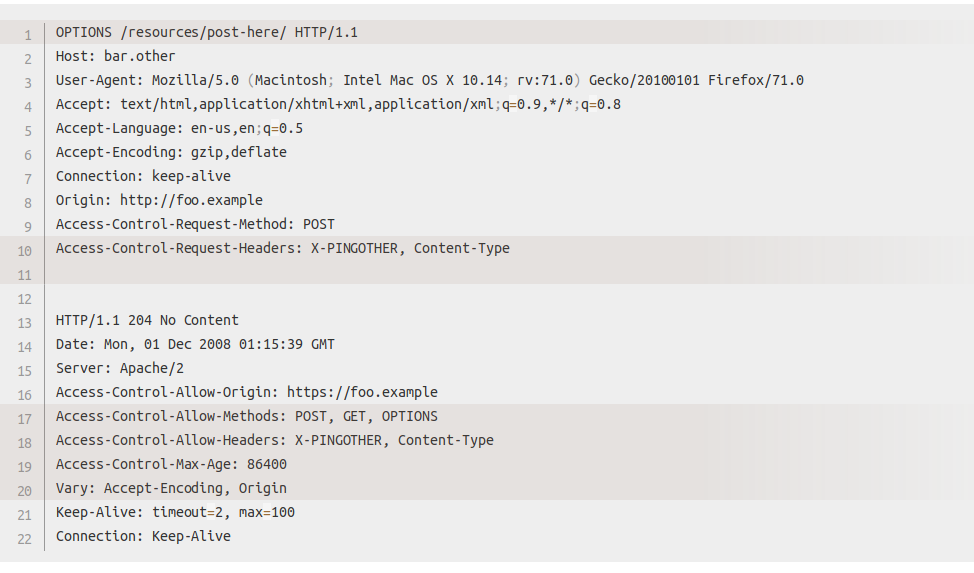
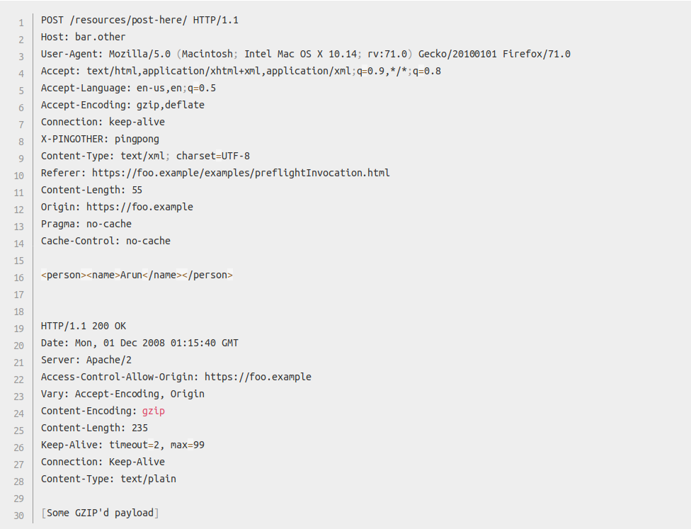
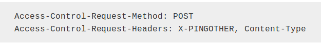
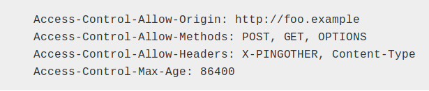

# Exercise 5: Cross Origin Resource Sharing.

In the context of Cross Origin Resource Sharing (CORS) explain in your own words what a preflight request is. Also explain when and why it's used by browsers. Preferably, use diagrams and/or code snippets for your explanation.

    • Preflight request – It is a HTTP request which is first send by the browser by using OPTIONS method to the resource which is on the other domain.
      It is used to determin that does the actual request is safe to send or not.  We use preflighted request since they may have implication on the user data.
    • Example -

The above example creates an XML body to send with the POST request.

Diagrammatically Representation of the pre-flight request

    • Now we will the full exchange of preflight request between the client and server:
      

    • Once the preflight request is complete, the real request is sent:

    • Here is the representation of  the preflight request with the OPTION method. The browser determines that it need to send this based on the request         parameters that the JavaScript code snippet above was using, so the server can decide to respond whether it is good to send the request with the actual    request parameters.
    • OPTIONS is and HTTP/1.1 method which is used to get the further information from the servers and it’s method which can’t be used to change the resource.
    • Along with OPTION request , two more request is send with it. The request are as follows:

    • The Access-Control-Request_Method header notifies the server as part of a preflight request that when the actual request is sent, it will be sent with a POST request method. 
    • The Access-Control-Request-Headers header notifies the server that when the actual request is sent, it will be sent with a X-PINGOTHER and Content-Type custom headers.
    • Now server has an option whether to accept the request or not.
    • After this the the server will send back a response that the server sends back indicating that the request method(POST) and request headers (X_PINGOTHER) are acceptable.  The response is like this:

    • Now the server will respond with Access-Control-=Allow-Methods are says that POST and GET are viable  methods to query the resource.
    • The server also sends Access-Control-Allow-Headers with a value of X- PINGOTHER, Content-Type, Confirming that these are permitted headers to be used with the actual request.
    • Finally Access-Control-Max-Age gives the value in seconds for how long the response to preflight request can be cached for without sending another preflight request.
  

## Reference

- https://cheatsheetseries.owasp.org/cheatsheetsCross_Site_Scripting_Prevention_Cheat_Sheet.html
- https://developer.mozilla.org/en-US/docs/Web/HTTP/CORS#Preflighted_requests
